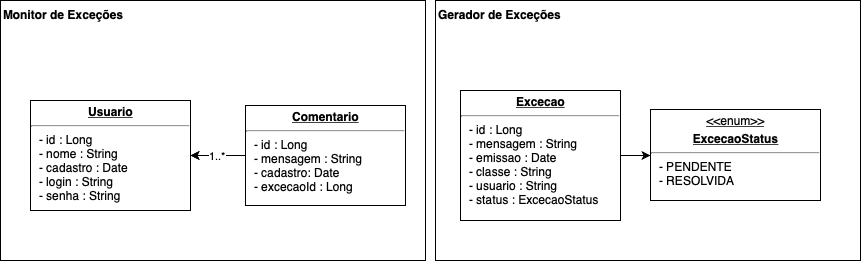

## Avaliação final ##

**Objetivo:** construir um sistema de monitoramento de exceções (*exception tracking*)

### Instruções ###
* Construa dois serviços: **gerador de exceções** e **monitor de exceções**.

* O seguinte modelo de dados deve ser considerado para os serviços:

* Crie a estrutura básica de cada projeto com Spring Boot, contendo as entidades do modelo, repositórios, serviços e controladores REST.
* Esses projetos devem estar em artefatos separados rodando em portas diferentes.
* Cada projeto deve ter também o seu próprio banco de dados (use JPA para a geração automática de tabelas)

#### Artefato 1 - Projeto Gerador de Exceções ####
* Crie um serviço de cadastro de usuário, incluindo os campos descritos no modelo. Nesse serviço, será possível gerar as seguintes exceções:
    1. Usuário já existe
    2. Senha fraca
    3. Falha interna ao criar usuário
3. Essas exceções devem ser capturadas e salvas como novos registros da entidade  "Excecao"
4. Caso nenhuma exceção seja gerada, o usuário deverá ser salvo no banco de dados

#### Arfefato 2 - Projeto Monitor de Exceções ####
* Crie um serviço de autenticação que considere os campos login e senha do usuário
* Crie um serviço que liste as exceções geradas e os seus metadados
* Crie um serviço para adicionar comentarios a uma exceção, no qual poderá ser mudado o status de uma exceção de pendente para resolvida.
* Para que seja possível exibir as exceções, use uma chamada REST remota ao serviço de geração de exceções (dica: use FeignClient).
* Ao adicionar um comentário, o campo "usuario" deverá ser atribuído ao usuário logado
* Os serviços de listagem de exceções só deverão ter acesso por usuários autenticados.

* Obs.: Deverá ser disponibilizada uma interface Swagger para o acesso aos serviços de ambos os artefatos.

Os dois artefatos deverão ser construídos separadamente e submetidos através do seguinte formulário:
https://forms.gle/rzKfzdr3Erby3ymcA
